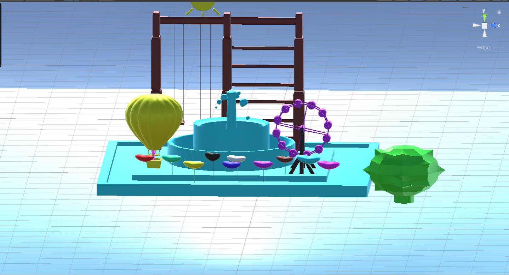

# YMGK-Unity 
[Go to Document](Gereksinim.docx)

## A ballon AR app that teaches counting to preschoolers with Vuforia
 
 
*App Image:*
 
 
 

 
 
 
Vuforia is a mobile augmented reality platform developed by PTC (Perceptive Technology, Inc.). It provides a wide range of features for creating Augmented

